**MOVIE TRACK**

Youtube link: https://youtu.be/nGw5TT5IQSs?feature=shared

Movie Track is an Android application designed to help users track their favorite movies, rate them, comment, and interact with friends. This README provides an overview of the app's features and functionality, along with instructions on how to set up and contribute to the project.

**Features**
**User Authentication**
Login Page: Users can log in with their credentials.
Create Account Page: New users can create an account if they don't have one.

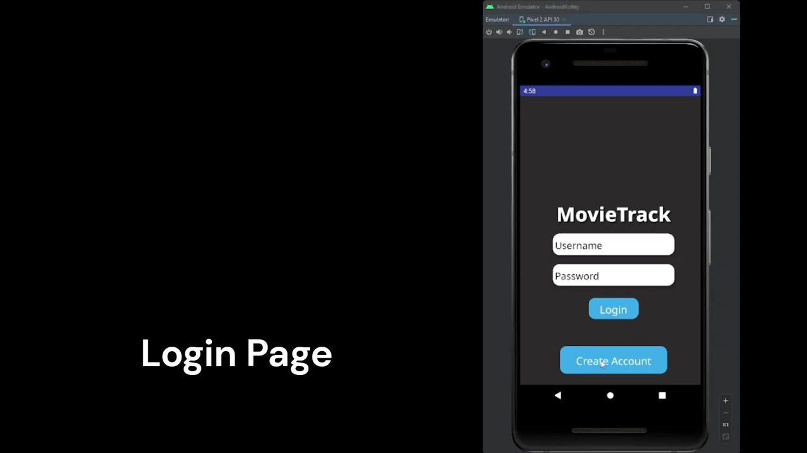

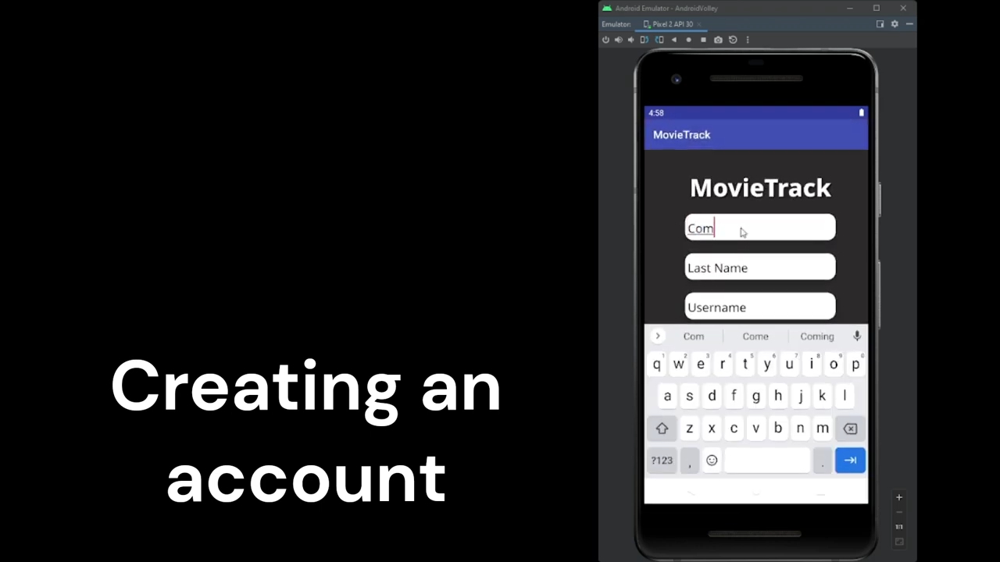

**Home Screen**
Displays a list of popular and upcoming movies.
Users can click on any movie to view detailed information.

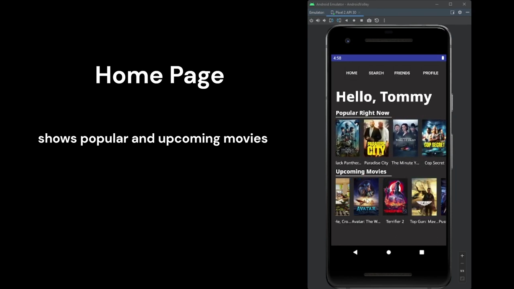

**Movie Info Page**
View the movie description.
Rate the movie.
Comment on the movie.
Add the movie to a personal list.

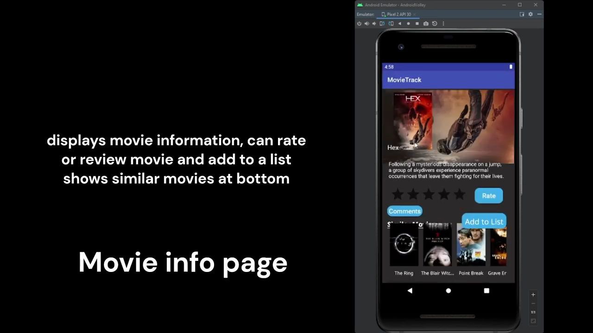

**Search Page**
Search for movies by title.
Returns a list of matching movies.

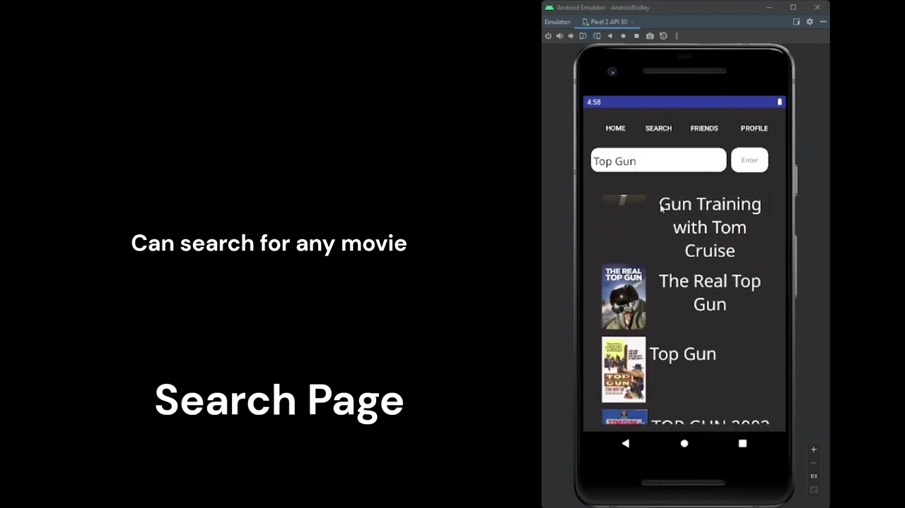

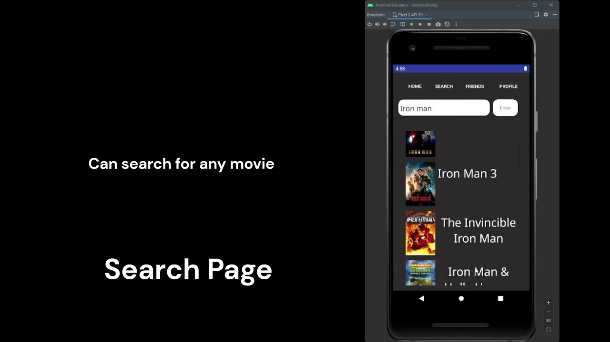

**Friends Page**
Search and add other users as friends.
View own and friends' logs (ratings and rating dates).

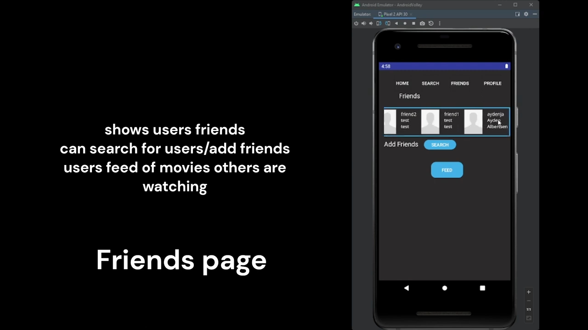

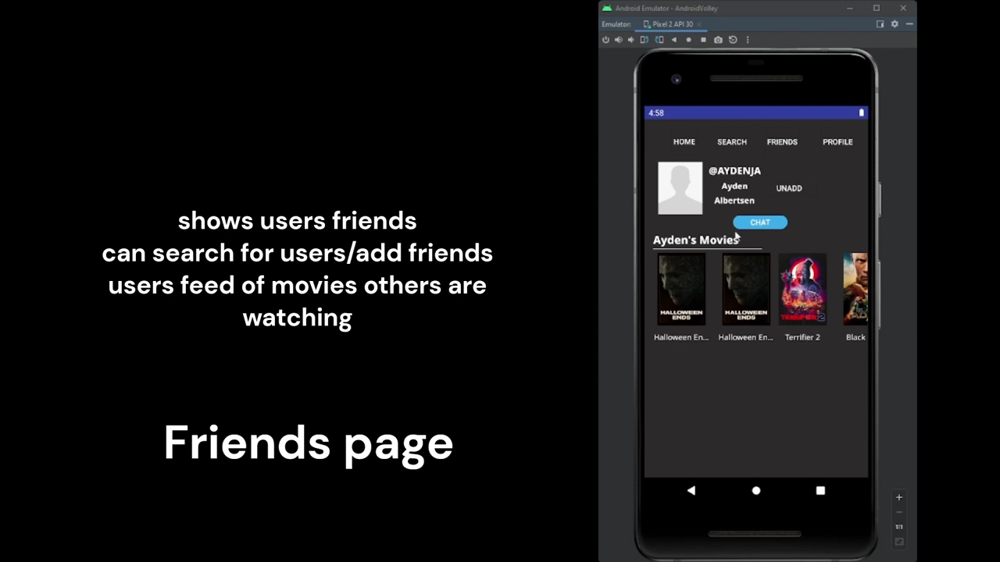

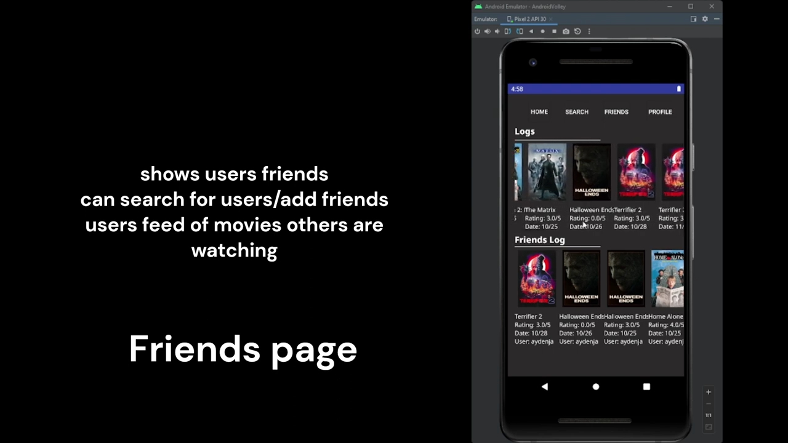

**Profile Page**
Displays user information and profile picture.
Edit personal information.
Create and edit lists.
Create alerts for upcoming movies.

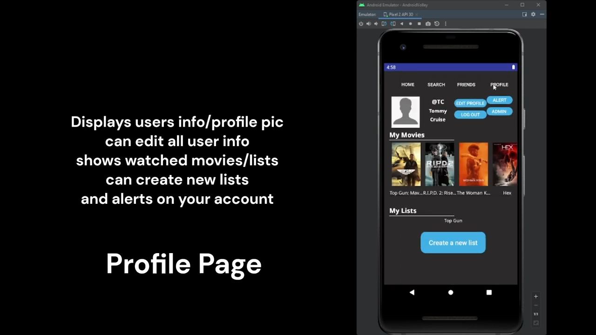

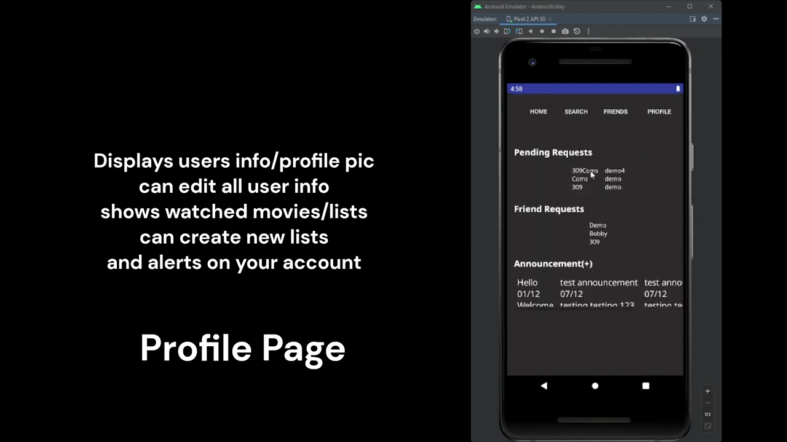

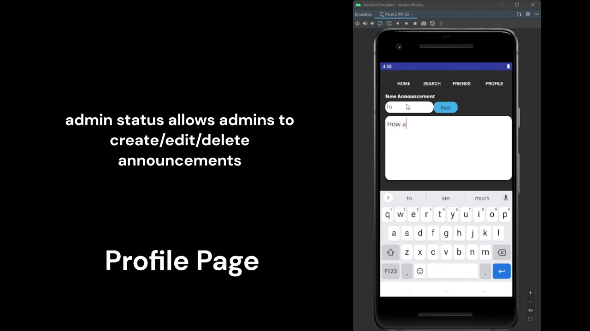

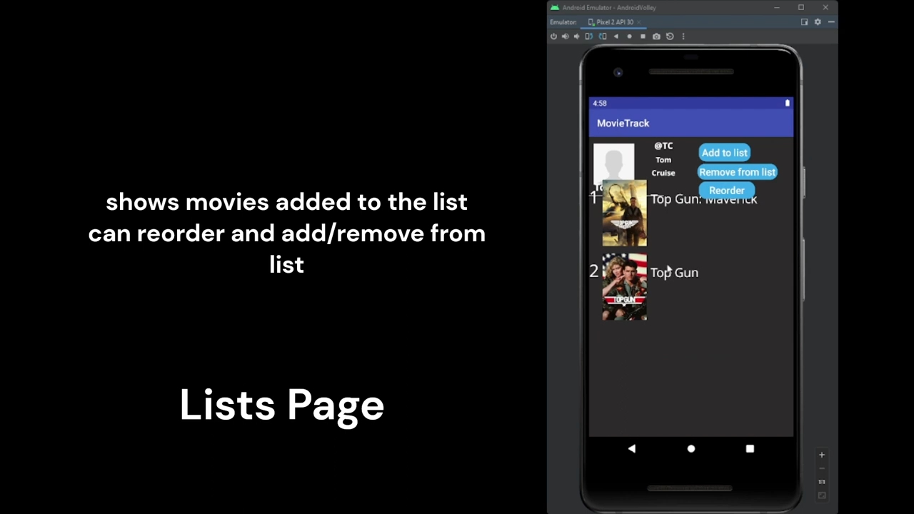

**Admin and Moderator Controls**
Additional controls and features are available for moderators and admins.

